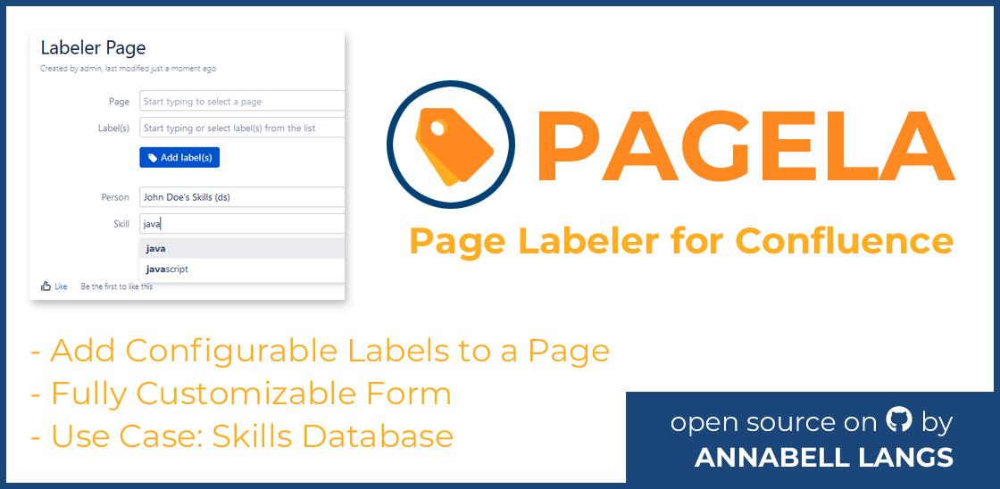
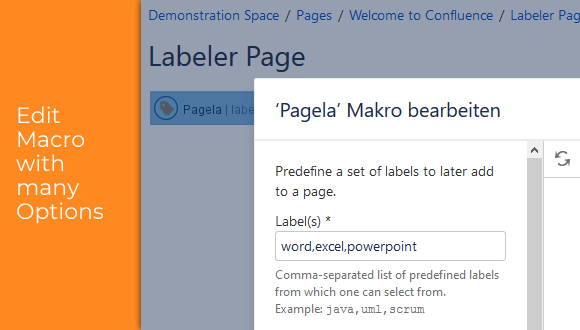
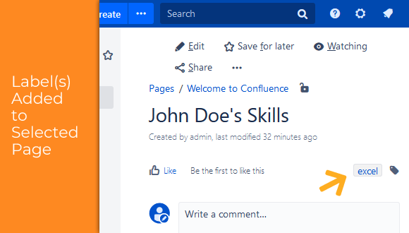

# Pagela Macro for Confluence
> Pagela (**Page** **La**beler) is a Confluence app (or macro) allowing to add from a configured list of labels one or multiple of these to pages. 

[![Confluence Version][conf-image]][conf-url] ![License][license-image]

This Confluence app allows to add a macro to a page with labels that can be configured. The macro is then rendered as a form which allows users to add one or more of the predefined labels to any page.
Thus the macro allows to curate labels for certain pages. 

One use case could be to setup a skills database where users can select from a list of labels (i.e. skills) those that they want to add to a page (i.e. their personal page). Thereby different spellings (of labels) can be avoided.

The macro provides texts in German and English. In addition, it allows to fully customize the texts of the rendered form to make it more user friendly for specific use cases.








## Installation

You can install this app directly from Atlassian's [Marketplace][pagela-marketplace].

Alternatively, setup Atlassian's SDK developer environment as mentioned under [Development setup](#dev).

Then execute the following command:

```sh
atlas-package
```

This generates a jar file within Maven's target folder. The file can be uploaded as an app in Confluence's "Manage apps" administrative menu. For more details, see [Installing Marketplace apps - Installing by file upload][conf-install-app].

## Usage example

Create a page in Confluence. In the macro browser, search for "pagela". In the setup dialog, add any amount of labels and optionally customize the form's texts.

Save the page with the pagela macro and switch to the actual view of the page. It will now display a form with two input fields and a button for submission.

The first field allows to select a page to which the labels should be added to. The second field allows to select one or multiple of the labels, that were configured during the macro setup.

Upon submitting the form, the label(s) will be added to the specified page. In case there is an issue with the request, appropriate messages will be issued to the user.

## <a name="dev"></a>Development setup

Please see Atlassian's [Getting started][conf-dev] guidelines on SDK development for details on how to setup the environment. This provides the ```atlas-*``` commands.

Then execute the following command:

```sh
atlas-run
```

This launches a developer Confluence instance.

Though the macro was manually tested during development, there are currently no tests yet.

## More

Annabell Langs - [annabell.langs.de][langs]

Distributed under the MIT license. See ``LICENSE`` for more information.

[https://github.com/alangs/pagela-macro][pagela-github]

## Contributing

This app is still under development.

I am happy to hear your feedback. Please get in contact if you have found a bug or simply follow the general GitHub process by creating a pull request.


<!-- Markdown link & img dfn's -->
[conf-image]: https://img.shields.io/badge/Confluence-7.7.3-green.svg
[conf-url]: https://atlassian.com/software/confluence
[conf-dev]: https://developer.atlassian.com/server/framework/atlassian-sdk/
[conf-install-app]: https://confluence.atlassian.com/upm/installing-add-ons-273875715.html
[license-image]: https://img.shields.io/github/license/alangs/pagela-macro.svg
[langs]: http://www.annabell.langs.de
[pagela-marketplace]: https://marketplace.atlassian.com/apps/1223503/pagela-page-labeler?tab=overview&hosting=server
[pagela-github]: https://github.com/alangs/pagela-macro